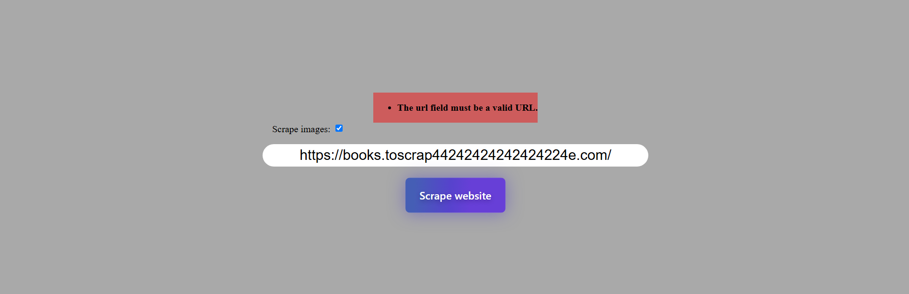
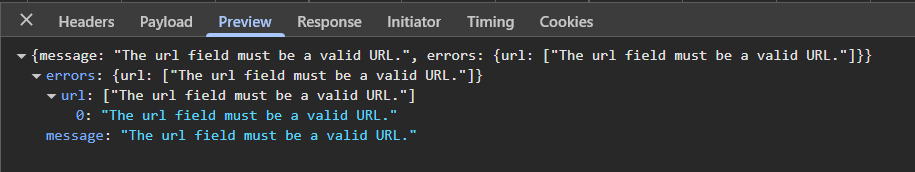
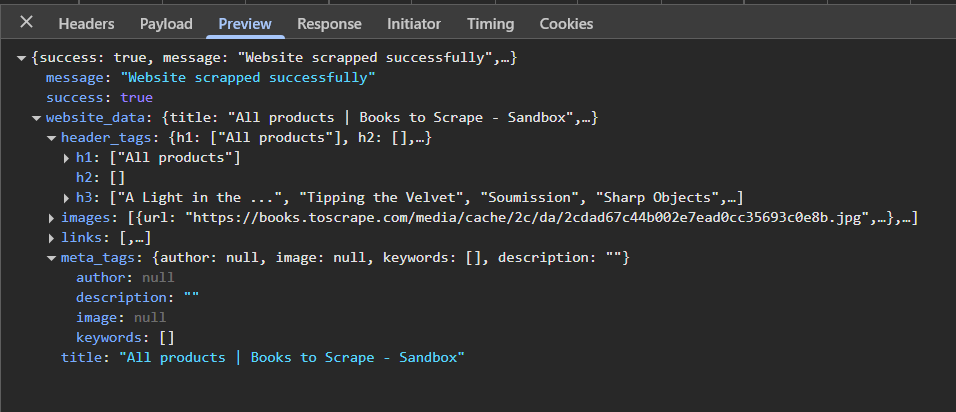

## About project
Realizacja zadania rekrutacyjnego:

Stwórz prostą aplikację webową, która pozwala użytkownikowi wpisać adres URL, a następnie wyświetla z niego wyciągnięte dane
(np. tytuł strony, meta description, listę nagłówków, obrazki).

## Built with:
* 
* 
* 
* 
* 

## Screenshots

